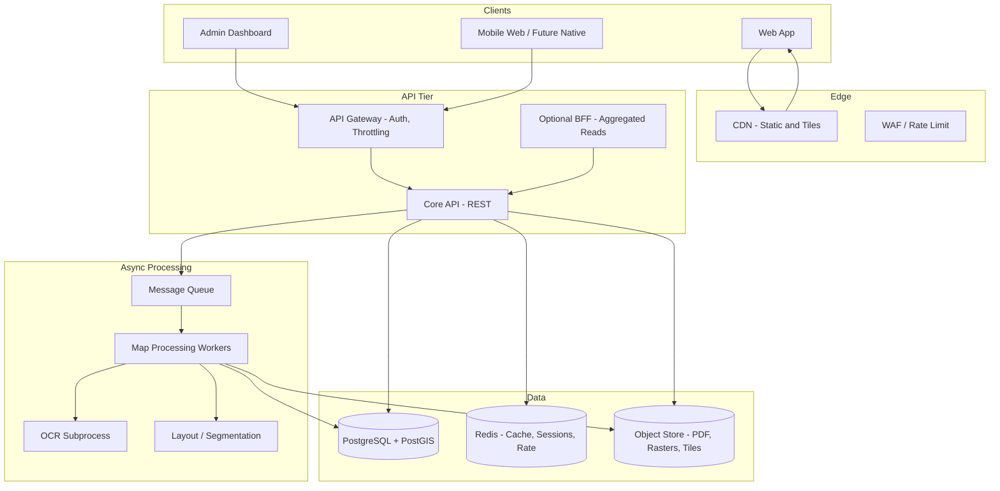

# System Architecture: VenueNav

## 1. Goals

- Ingest event map PDFs, produce navigable **local coordinate** maps (no GPS assumption).
- **Graph-based** routing (nodes/edges) with sub-200ms route generation on published maps at scale.
- **Multi-tenant** hierarchy: organizations → events → venues → maps.
- **Hybrid** map building: CV/OCR for bootstrapping, **human-in-the-loop** correction in admin.

## 2. High-Level Diagram

## 3. Service Boundaries

| Service / Module | Responsibility |
|------------------|----------------|
| **Core API** | CRUD for orgs, events, venues, maps, shops; authZ; start processing jobs; publish map versions. |
| **Map Processing** | PDF → raster, deskew, optional page split; run segmentation / wall & booth detection; OCR for labels; emit **draft** graph + polygons; store artifacts. |
| **Graph Management** | Persist nodes, edges, shop ↔ node links, polygons; version snapshots; diff between draft and published. |
| **Routing Engine** | Load **published** graph snapshot for `(map_id, version)`; run Dijkstra / A*; optional multi-stop (TSP heuristic + order); **no DB round-trips** per request when cache hit. |
| **Search** | PostgreSQL `tsvector` + GIN for shop names and tags; optional OpenSearch for scale. |

In smaller deployments, Core API, Graph Management, and Routing can run as one process with internal modules. Split workers for CPU/GPU bound map jobs.

## 4. Map Processing Pipeline

1. **Upload** → object storage; record `map_processing_job` (status `queued`).
2. **Rasterize** PDF to PNG/WebP at consistent DPI; store with `map_asset` rows.
3. **Preprocess** (optional): denoise, auto-crop, rotation correction.
4. **Segmentation** (pluggable): walkable floor vs walls; booth/stall blobs; output masks GeoJSON in **map pixel space**.
5. **Skeleton + graph**: thin walkable mask → medial axis / grid sampling → candidate nodes; connect neighbors within walkable area → draft edges; weights = Euclidean or grid distance in **map units**.
6. **OCR**: Tesseract, PaddleOCR, or cloud OCR; associate text boxes to nearest booth region.
7. **Draft persist**: write `map_graph_draft` or versioned draft tables; set job `awaiting_review`.
8. **Admin edit**: user adjusts nodes, edges, shop polygons, shop metadata.
9. **Publish**: snapshot to **published** tables + **immutable** `map_version` row; precompute hot routes optionally; flush/invalidate cache.

## 5. Navigation & Performance

- **Local coordinates**: one SRID (e.g. `0` custom or a dedicated fake SRID) per map; store `(x, y)` in map units (pixels at canonical scale, or physical meters if scale is provided).
- **Routing**: weighted graph. Use **A\*** with Euclidean heuristic to target when end node is known; else Dijkstra. Pre-stored graph as adjacency list in Redis or in-memory for the published version (loaded at publish time).
- **<200ms target**: (1) serve routes from in-process graph + no IO; (2) **short-lived cache** Redis key `route:{map_ver}:{from}:{to}`; (3) cap graph size per map with simplification; (4) warm cache for popular pairs at publish.
- **Scale reads**: read replicas for GET-heavy endpoints; **published graph** is read-mostly. Writes isolated to admin flows.

## 6. Multi-Event & Tenancy

- `organization` → `event` → `venue` (optional) → `map` → `map_version`.
- All queries scoped by `organization_id` and RBAC (owner, editor, viewer).
- **Row-level** enforcement in API + DB policies where feasible.

## 7. Reliability & Degradation

- **Idempotent** job processing; retry with exponential backoff; dead-letter queue for failed jobs.
- If routing cache cold: still compute in-memory, stay within SLO for typical map sizes.
- If search degraded: return shops from cached list embedded in `map` payload.
- **Health**: liveness/readiness; dependency checks (DB, Redis, queue).

## 8. Security

- Pre-signed URLs for uploads; virus scan (optional) before processing.
- PDF/raster size limits; job timeouts.
- Audit log for publish and permission changes.

## 9. Technology Choices (Suggested)

- **API**: Node (NestJS/Fastify) or Python (FastAPI) — both fine; workers often Python for CV stack.
- **DB**: PostgreSQL 15+ + PostGIS 3+.
- **Queue**: SQS, RabbitMQ, or Redis Streams.
- **Object**: S3-compatible storage.
- **Frontend**: React + canvas/WebGL (Pixi.js, MapLibre custom layer, or Konva) for large maps; **vector** overlay for paths and POIs.

## 10. Future Hooks

- **Positioning**: fuse BLE beacons to snap user to nearest node.
- **Crowd**: edge weights from live occupancy (future service).
