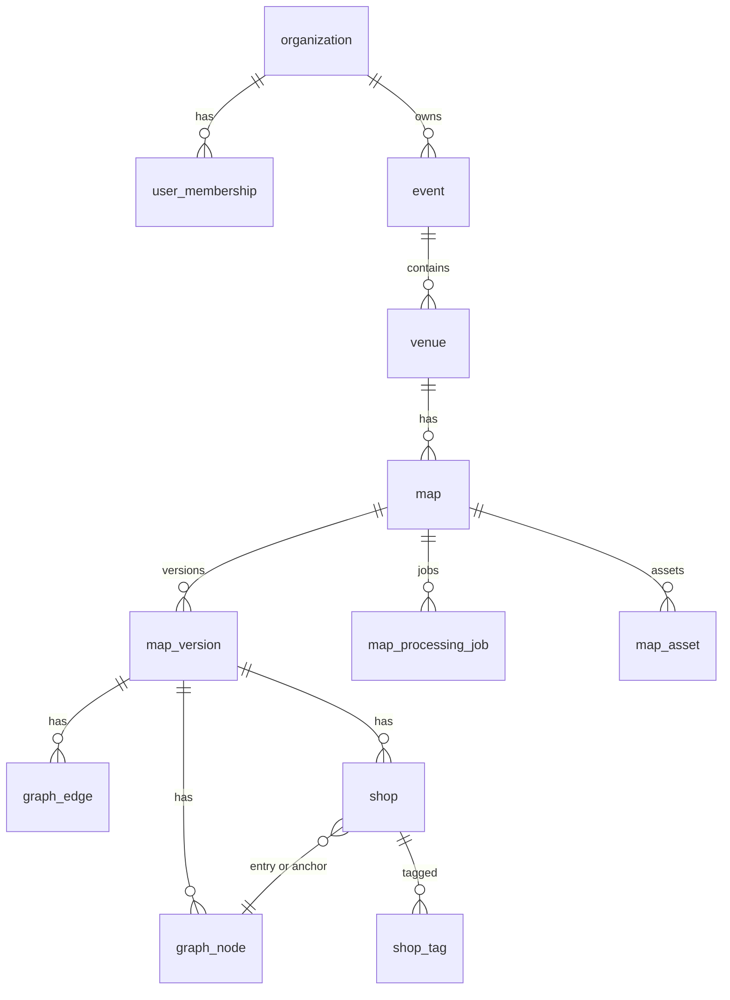

# Database Design

## 1. Principles

- **PostgreSQL 15+** with **PostGIS 3+** for polygons, polylines, and spatial queries (shop hit-testing, “what’s at point?”).
- **Map version immutability**: published routing uses `map_version_id`; draft edits do not move attendees until publish.
- **SRID**: use a **projected** or custom local SRID per map, or store plain `double precision` x/y in map space with a `map_units` enum (`pixel`, `meter`) on `map`.

## 2. Entity Relationship (Conceptual)



## 3. Key Tables (Summary)

| Table | Purpose |
|-------|---------|
| `organization` | Tenant root. |
| `user` / `user_membership` | Users and org roles. |
| `event` | Conference, fair, etc. |
| `venue` | Building or hall; optional if one venue per event. |
| `map` | Logical map; links to current draft/published version pointers. |
| `map_version` | Immutable snapshot when published: scale, width/height, SRID, status. |
| `map_asset` | PDF path, rasters, generated masks (URLs + metadata). |
| `map_processing_job` | Pipeline state, errors, worker id. |
| `graph_node` | Point in map space; type (intersection, entrance, etc.). |
| `graph_edge` | Edge between two nodes; weight, optional `geom` as LineString. |
| `shop` | Name, category, `location_node_id`, optional `footprint` polygon. |
| `shop_tag` | Normalized tags for faceted search. |

## 4. Spatial Details

- **`graph_node.geom`**: `POINT` in map coordinates.
- **`graph_edge.path`**: optional `LINESTRING` for curved corridors (weight from length).
- **`shop.footprint`**: `POLYGON` for click hit-testing; centroid for labels.
- **Indexes**: GiST on spatial columns; B-tree on foreign keys and `(map_version_id)`.

## 5. Search

- `shop.search_vector` **tsvector** updated on name/category change; GIN index.
- Optional: `jsonb` for vendor metadata with GIN for flexible filters.

## 6. Migrations

Executable DDL lives in `sql/001_init.sql`. Evolve with numbered migrations in production (Flyway, Liquibase, Alembic, or Atlas).

## 7. Example Query: Shops Near Point

```sql
-- Point-in-polygon: which booth at click (x, y) in map space?
SELECT s.id, s.name
FROM shop s
WHERE s.map_version_id = $1
  AND ST_Contains(
    s.footprint,
    ST_SetSRID(ST_MakePoint($2, $3), $4)
  );
```

(Adjust SRID/geometry columns to match your chosen storage pattern.)
