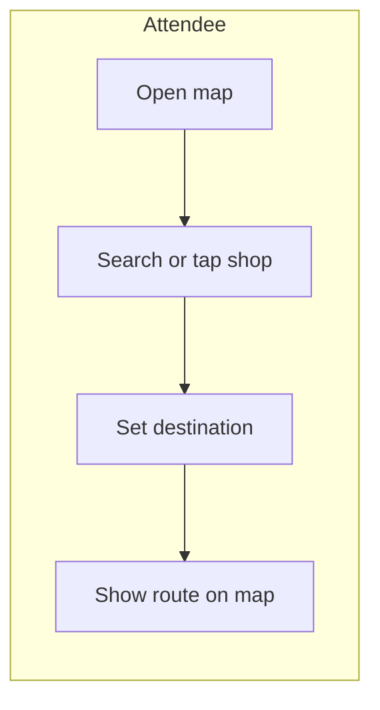
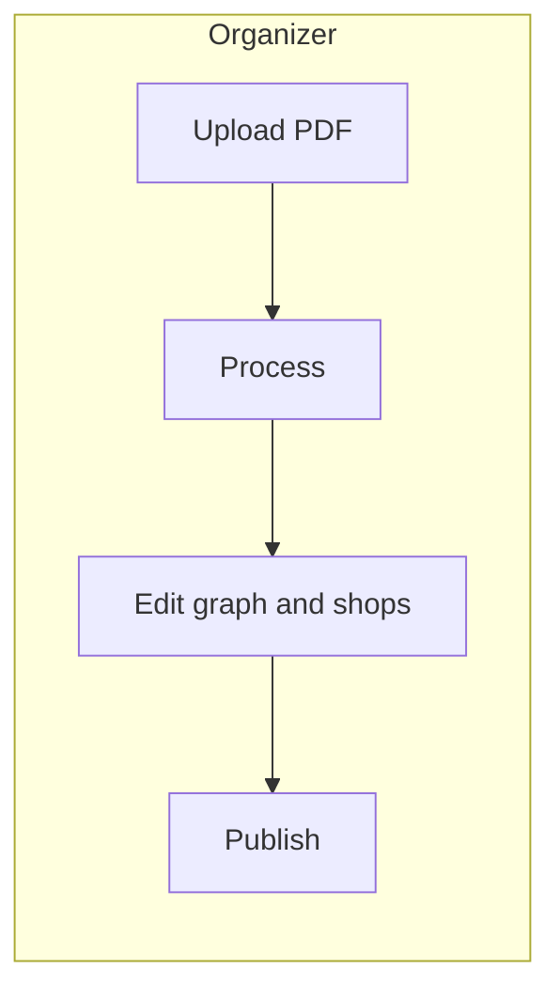

# UI / UX Wireframes (Textual)

Conventions: **public** = attendee map; **admin** = organizer dashboard. Design for desktop-first admin; public works on **mobile** with touch zoom/pan.

---

## 1. Public: Event Map Home

**Purpose:** Open a single event map quickly with search and route.

```
┌─────────────────────────────────────────────┐
│  [Logo]  Event name          [Search... 🔍] │
├─────────────────────────────────────────────┤
│ ┌─────────────────────────────────────────┐ │
│ │                                         │ │
│ │         MAP (pinch/drag)                │ │
│ │    [booth polygons, path overlay]        │ │
│ │                                         │ │
│ │              [+] [-]  (zoom)            │ │
│ └─────────────────────────────────────────┘ │
│  Selected: "Shop A"   [Route from] [Go]     │
└─────────────────────────────────────────────┘
```

**Interactions:**

- **Search** opens a bottom sheet (mobile) or dropdown (desktop): list of shops with category chips; selecting zooms to footprint and sets **route destination** or **“start here”** if user holds **From**.
- **Tap shop** on canvas → highlight, show card (name, category, “Directions”).
- **Route** draws polyline on top of raster; start/end markers at graph nodes; optional step list: “Entrance → Aisle 2 → Shop A” (node labels).

**States:** loading skeleton for raster; offline banner if only cached; error toast if version mismatch.

---

## 2. Public: Search Overlay

```
        Search "coffee"
   ┌──────────────────────┐
   │ Flat White — Cafe    │
   │ Bean Bros — Food     │
   │ (3 more)             │
   └──────────────────────┘
```

**Filters:** category tabs (Food, Merch, Services). **Recent** searches (local storage).

---

## 3. Public: Route Result

```
┌─────────────────────┐
│ From: Main Entrance  │
│ To:   Shop A         │
│ ~2 min · 45 m*       │  *if scale known
│ ▼ Turn-by-turn (nodes)│
└─────────────────────┘
```

**Multi-stop:** show ordered list; “Reoptimize” if allowed.

---

## 4. Admin: Organization / Event List

**Layout:** left nav (Orgs, Events, Settings); main table with columns Name, Date, #Maps, Status.

```
Events                    [+ New event]
┌────────────┬────────────┬────────┐
│ Name       │ When       │ Maps   │
├────────────┼────────────┼────────┤
│ TechFair   │ May 1–3    │ 3      │
└────────────┴────────────┴────────┘
```

---

## 5. Admin: Map List (inside Event)

```
Maps for TechFair         [+ Add map]
┌──────────┬──────────┬────────────┐
│ Map      │ Status   │ Version    │
├──────────┼──────────┼────────────┤
│ Hall A   │ published│ v4         │
│ Hall B   │ draft    │ v2 (draft) │
└──────────┴──────────┴────────────┘
```

**Row actions:** Open editor, Duplicate, Archive.

---

## 6. Admin: Map Ingestion

**Stepper:** `Upload PDF` → `Processing` → `Review` → `Publish`

### 6.1 Upload

- Drop zone, file type/size hints.
- After upload, show asset thumbnail and “Start processing”.

### 6.2 Processing

- Progress bar with stages (rasterize, detect, OCR).
- **On failure:** error message, link to support, “Retry with options” (DPI, single page).

### 6.3 Review (Graph Editor) — full screen

```
┌─ Toolbar ───────────────────────────────────────┐
│ Select │ Node │ Edge │ Polygon │ Pan │ Undo    │
├──────────┬──────────────────────────────────────┤
│ Layers   │  Canvas (raster + vector overlay)     │
│ ☑ Raster │                                      │
│ ☑ Graph  │   [Walls faint, path edges, nodes]   │
│ ☑ Shops  │                                      │
│ ☐ Aisle #│                                      │
├──────────┴──────────────────────────────────────┤
│ Properties: Node N12 — type [intersection ▼]    │
│            Shop S3 — name [___]  category [__]  │
│            [Save draft]  [Publish v5]            │
└────────────────────────────────────────────────┘
```

**Editor behaviors:**

- **Snap** new nodes to walkable area (if mask available).
- **Delete edge** with selection; **split edge** to insert node.
- **Shop polygon:** draw or adjust vertices; **link to nearest** graph node for routing.
- **OCR suggestions** as ghost labels; accept/reject to shop name field.

**Publish:** confirm dialog, diff summary (nodes/edges added/removed), **irreversible** for version number.

---

## 7. Admin: Mobile (reduced)

- **Read-only** monitoring of jobs; **full editing** on tablet minimum—complex on phone (optional v2).

---

## 8. Design Tokens (Recommendations)

- **Focus:** high contrast for route (brand accent), muted base map.
- **Touch:** 44px minimum targets; obvious zoom control on mobile.
- **Accessibility:** keyboard nav for list views; ARIA for search; colorblind-safe route line + dash pattern.

---

## 9. User Flows (Mermaid)





This document is sufficient for a design handoff; high-fidelity mockups can follow in Figma using the same structure.
